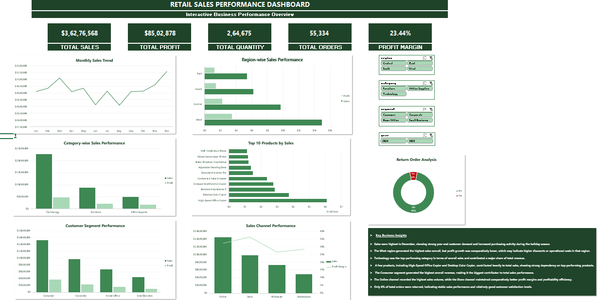

## Dashboard Preview




[View full dashboard PDF](export/Retail_sales_performance_dashboard.pdf)

```markdown
# Retail Sales Performance Dashboard (Excel + Power Query)

## Project Overview

This project focuses on analyzing retail sales performance using Microsoft Excel and Power Query. The goal was to build an interactive dashboard that can be used to monitor sales, profit, customer segments, product performance, regional trends, returns, and sales channels.

The project follows a complete data analysis workflow starting from raw data preparation, data cleaning, transformation, validation, analysis, and finally dashboard development.

---

## Business Objective

The objective of this project is to help business users answer questions such as:

- Which regions generate the highest sales?
- Which product categories perform best?
- What are the monthly sales trends?
- Which customer segments contribute the most revenue?
- How profitable are different sales channels?
- What percentage of orders are returned?
- Which products drive the majority of sales?

---

## Dataset Information

The project uses a retail sales dataset containing more than 100,000 records.

### Main Fields

- Order ID
- Order Date
- Ship Date
- Customer Information
- Product Information
- Category & Subcategory
- Quantity
- Unit Price
- Discount
- Sales
- Cost
- Profit
- Region
- Sales Channel
- Payment Type
- Return Status
- Account Manager

---

## Tools Used

- Microsoft Excel
- Power Query
- Pivot Tables
- Pivot Charts
- Slicers
- Excel Formulas

---

## Data Preparation Process

The raw data was processed using Power Query.

### Transformations Performed

- Imported raw CSV files
- Appended datasets into a single source
- Fixed data types
- Removed duplicate records
- Handled blank values
- Applied Trim and Clean transformations
- Standardized category names
- Validated order and shipping dates
- Created reporting fields such as Month, Quarter, and Year
- Loaded cleaned data into Excel for analysis

---

## Dashboard Features

### KPI Section

- Total Sales
- Total Profit
- Total Orders
- Profit Margin

### Analysis Included

#### Monthly Sales Trend
Tracks sales performance across months to identify seasonality and growth patterns.

#### Region-wise Performance
Compares sales and profit across business regions.

#### Category Performance
Evaluates category contribution to overall sales and profit.

#### Top Products Analysis
Identifies products generating the highest revenue.

#### Customer Segment Analysis
Compares performance across Consumer, Corporate, and Home Office segments.

#### Sales Channel Analysis
Measures revenue and profitability across Online, Store, and Marketplace channels.

#### Return Order Analysis
Monitors returned orders and return percentage.

### Interactive Features

- Region Filter
- Category Filter
- Segment Filter
- Year Filter

---

## Key Insights

- Sales reached their highest level in December, indicating strong year-end demand.
- The West region generated the highest sales, although profit growth was comparatively lower.
- Technology was the strongest category in terms of sales contribution.
- A small group of products contributed a significant share of total revenue.
- The Consumer segment generated the highest overall sales.
- The Online channel produced the highest sales volume, while the Store channel maintained stronger profit margins.
- Only 6% of total orders were returned, indicating stable overall performance.

---

## Project Structure

```text
Retail_Sales_Performance_Dashboard_Excel_Project/
│
├── dashboard/
│   └── Retail_Sales_Performance_Dashboard.xlsx
│
├── data/
│   ├── raw/
│   ├── lookups/
│   └── cleaned/
│
├── export/
│   └── Retail sales performance dashboard.pdf
│
├── Screenshot/
│   └── Retail sales performance dashboard.png
│
└── README.md
```
